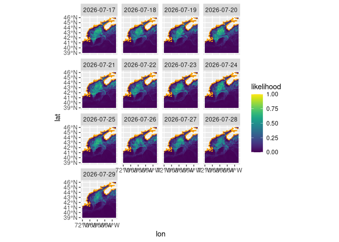
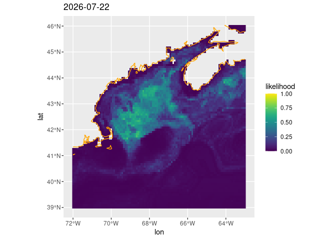

copernicus
================

Provides access simplified distribution of [ecopmo
forecasts](https://github.com/BigelowLab/ecopmo) forecasts for *Calanus
finmarchicus*.

## Requirements

- [R v4.2+](https://www.r-project.org/)
- [rlang](https://CRAN.R-project.org/package=rlang)
- [ggplot2](https://CRAN.R-project.org/package=ggplot2)
- [viridis](https://CRAN.R-project.org/package=viridis)
- [sf](https://CRAN.R-project.org/package=sf)
- [stars](https://CRAN.R-project.org/package=stars)
- [yaml](https://CRAN.R-project.org/package=yaml)

## Installation

    remotes::install_github("BigelowLab/calfinforecast")

## Daily refreshing

Each day the repository and package are refreshed using…

`$ Rscript /mnt/s1/projects/ecocast/corecode/R/ecopmo_forecast/calfinforecast/inst/scripts/copy_forecast.R`

This copies the most recent forecasts (-5 days to +10 days, although
that will vary by available forecast data.) Makes a copy of the most
recent configuration list, saves both a time-faceted forecast plot as
well as per day forecast plots.

# Functions

Data are stored within the package, so we provide function to easily
read these data.

## Rasters

Read the raw forecast data as raster,

``` r
library(calfinforecast)
x = read_raster()
x
```

    ## stars object with 3 dimensions and 1 attribute
    ## attribute(s), summary of first 1e+05 cells:
    ##               Min.     1st Qu.     Median       Mean   3rd Qu.      Max.  NA's
    ## q050  0.0003209292 0.009350357 0.02676463 0.08899682 0.1295596 0.8283182 34222
    ## dimension(s):
    ##      from  to     offset    delta refsys point x/y
    ## x       1 415     -77.04  0.08333 WGS 84 FALSE [x]
    ## y       1 261      56.71 -0.08333 WGS 84 FALSE [y]
    ## time    1  13 2026-07-17   1 days   Date    NA

## Spatial cropping

Read in the convenience spatial bounding box.

``` r
bb = get_bb(reg = "gom")
bb
```

    ## xmin ymin xmax ymax 
    ##  -72   39  -63   46

## Configuration

The configuration list may provide important contextual information.

``` r
cfg = read_config()
str(cfg)
```

    ## List of 10
    ##  $ species            : chr "calfin"
    ##  $ longname           : chr "Calanus finmarchicus"
    ##  $ version            : chr "v1.01"
    ##  $ class              : chr "right whale prey"
    ##  $ note               : chr "same as v0/1.00 but using 90th percentile of abudnance as threshold"
    ##  $ verbose            : logi TRUE
    ##  $ training_data      :List of 5
    ##   ..$ species       : chr "calfin"
    ##   ..$ species_data  :List of 4
    ##   .. ..$ ecomon_column: NULL
    ##   .. ..$ alt_source   : chr "function"
    ##   .. ..$ function     : chr "read_merged"
    ##   .. ..$ threshold    :List of 2
    ##   .. .. ..$ pre : num 39725
    ##   .. .. ..$ post: NULL
    ##   ..$ classification:List of 3
    ##   .. ..$ name  : chr "patch"
    ##   .. ..$ levels: int [1:2] 1 0
    ##   .. ..$ labels: chr [1:2] "1" "0"
    ##   ..$ coper_data    :List of 6
    ##   .. ..$ vars_static: chr "deptho"
    ##   .. ..$ reg_phys   : chr "chfc"
    ##   .. ..$ vars_phys  : chr [1:6] "temp_bot" "mlotst_mld" "sal_sur" "temp_sur" ...
    ##   .. ..$ reg_bgc    : chr "world"
    ##   .. ..$ vars_bgc   : NULL
    ##   .. ..$ vars_time  : chr [1:2] "day_length" "ddx_day_length"
    ##   ..$ split         :List of 3
    ##   .. ..$ func : chr "rsample::mc_cv"
    ##   .. ..$ prop : num 0.75
    ##   .. ..$ times: int 25
    ##  $ model              :List of 3
    ##   ..$ seed           : num 799
    ##   ..$ model          :List of 9
    ##   .. ..$ name          : chr "Boosted Regression Tree"
    ##   .. ..$ engine        : chr "xgboost"
    ##   .. ..$ trees         : num 500
    ##   .. ..$ learn_rate    : num 0.1
    ##   .. ..$ tree_depth    : num 4
    ##   .. ..$ mtry          : num 5
    ##   .. ..$ min_n         : num 10
    ##   .. ..$ nthread       : num 4
    ##   .. ..$ engine_version: chr "3.2.1.1"
    ##   ..$ transformations: chr [1:2] "step_log_bathy" "step_normalize_numeric"
    ##  $ predict            :List of 1
    ##   ..$ quantiles: num [1:7] 0 0.05 0.25 0.5 0.75 0.95 1
    ##  $ suggested_threshold:List of 2
    ##   ..$ quantile : num 0.5
    ##   ..$ threshold: num 0.283

## Graphics

Graphics can be composed of one time-facted plot or a collection of
per-day plots.

``` r
gg1 = plot_forecast(x, wrap = TRUE, crop = get_bb(reg = "gom"))
gg1
```

<!-- --> Alternatively
we can retrieve a listing with one graphic per day.

``` r
gg2 = plot_forecast(x, wrap = FALSE, crop = get_bb(reg = "gom"))
gg2[[6]]
```

<!-- -->

## Images

Each of these is rendered as a PNG. You can list them…

``` r
list_images("wrapped") |>
  basename()
```

    ## [1] "wrapped.png"

``` r
list_images("daily") |>
  basename()
```

    ##  [1] "2026-07-17.png" "2026-07-18.png" "2026-07-19.png" "2026-07-20.png"
    ##  [5] "2026-07-21.png" "2026-07-22.png" "2026-07-23.png" "2026-07-24.png"
    ##  [9] "2026-07-25.png" "2026-07-26.png" "2026-07-27.png" "2026-07-28.png"
    ## [13] "2026-07-29.png"

## Download raw data

You can download the raw data using this command, and then read it in as
a stars object.

``` r
ok = download.file("https://github.com/BigelowLab/calfinforecast/raw/refs/heads/main/inst/extdata/data.Rds", "data.Rds")
x = readRDS("data.Rds")
x
```

    ## stars object with 3 dimensions and 1 attribute
    ## attribute(s), summary of first 1e+05 cells:
    ##               Min.     1st Qu.     Median       Mean   3rd Qu.      Max.  NA's
    ## q050  0.0003209292 0.009350357 0.02676463 0.08899682 0.1295596 0.8283182 34222
    ## dimension(s):
    ##      from  to     offset    delta refsys point x/y
    ## x       1 415     -77.04  0.08333 WGS 84 FALSE [x]
    ## y       1 261      56.71 -0.08333 WGS 84 FALSE [y]
    ## time    1  13 2026-07-17   1 days   Date    NA
